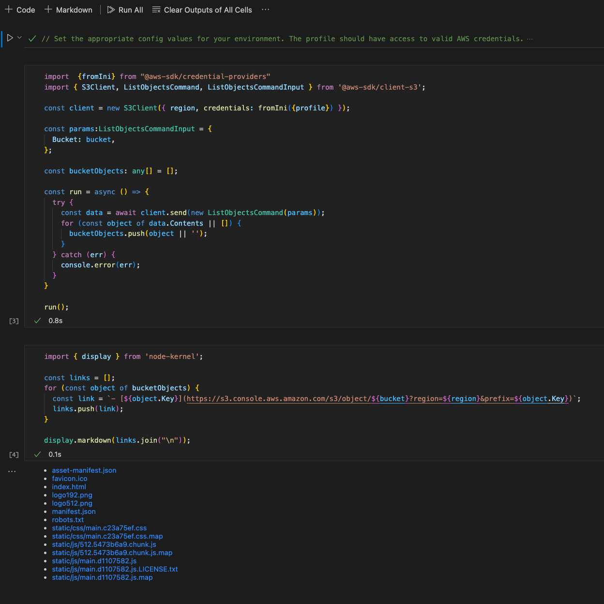

# Cloudbook

A collection of VS Code [Notebooks](https://code.visualstudio.com/blogs/2021/11/08/custom-notebooks) for gathering context from Cloud Providers (i.e. AWS). One scenario might be to get users from Cognito and fetch related data from DynamoDB, S3 or similar services. I'm sure there are tons of other useful cases.

## Getting Started

- Checkout the repo locally
- Make sure to install the [Nodejs Notebook](https://marketplace.visualstudio.com/items?itemName=donjayamanne.typescript-notebook)
- run `yarn install`
- head over to [./notebooks/s3-object-list.nnb](./notebooks/s3-object-list.nnb) for an example (Github can't render the notebook, works only locally)

## AWS Credentials

Works best with correctly configured `~/.aws/config` (e.g. with AWS SSO). Not recommended but possible: using in static credentials.

## Contributions

Would love to get more use-cases and examples. Would also be keen to improve the general UX of configuring inputs. Please feel free to create pull requests!